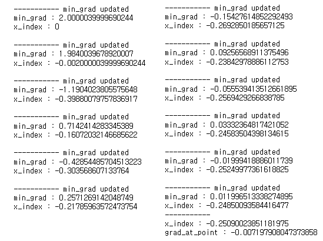

# 경사 하강법(Gradient Descent)
##### 딥러닝 알고리즘 학습 시 사용되는 최적화 방법 중 하나
##### 미분을 통해 손실 함수의 크기를 최소화시키는 파라미터를 찾는 방법
---
## 개념
* 손실함수는 예측값과 정답값의 차이이므로 손실함수의 크기가 작을수록 알고리즘이 최적화
* 손실함수를 최소화하는 파라미터를 업데이트하고 찾는게 목표
* 특정 위치에서 손실함수의 미분값과 학습률을 곱한 값을 파라미터에서 빼줌
$\rightarrow$ 미분값이 음수라면 양의 방향으로, 미분값이 양수라면 음의 방향으로 파라미터 업데이트

$$ \omega \rightarrow 파라미터$$

$$ \alpha \rightarrow 학습률$$

$$ \omega_{n}=\omega_{n-1}-\alpha\nabla f(\omega_{n-1})$$

## 코드
```python
# --------------------------- modules --------------------------- #
import random
import numpy as np
import matplotlib.pyplot as plt

# -------------------------- functions -------------------------- #

# 함수의 계수를 랜덤으로 추출
def random_func(var_num, var_range):
    # [1, 6) 범위 -> 2차 함수를 사용할 예정이고 convex 함수여야 경사하강법을 사용할 수 있음
    var_picked = np.random.randint(1, var_range+1, size=var_num)
    print(var_picked)
    return var_picked

# 함숫값 계산
def cal_func(var_list, x_index):
    x_list = np.array([x_index**i for i in range(len(var_list))])
    return sum(var_list*x_list)

# 미분
def grad_func(var_list, x_index):
    # 일반적으로 람다값이 1e-6 일때 퍼포먼스가 좋다고 함
    lambda_x = 1e-6
    func_val = cal_func(var_list, x_index)
    func_val_lambda = cal_func(var_list, x_index+lambda_x)
    return (func_val_lambda - func_val) / lambda_x

# 경사하강법
def gradient_descent(var_num, var_range, picked_var):
    # 그래프 그리려고 데이터 수집
    return_x_list = []
    return_grad_list = []
    
    # x가 0에서 시작
    x_index = 0
    # 최소 미분값 비교를 위해 저장
    min_grad = np.inf
    # 학습률 -> 비교적 작은 단위를 다룰거라 적절하게 잡음
    alpha = 1e-3
    # 학습 횟수
    epochs = 200
    # 학습 횟수 카운트
    cnt = 0
    while True:
        if cnt > epochs:
            break
        # 초기 미분값 계산
        grad_at_point = grad_func(picked_var, x_index)
        
        # 기울기가 목푯값보다 작으면 중지
        if abs(grad_at_point) < 0.01:
            min_grad = grad_at_point
            print('-----------')
            print(f'grad_at_point : {grad_at_point}')
            break
        # 현재 기울기가 저장된 기울기 최솟값보다 작으면
        if min_grad > abs(grad_at_point):
            print('\n----------- min_grad updated')
            print(f'min_grad : {grad_at_point}')
            print(f'x_index : {x_index}')
            # 기록하고
            return_x_list.append(x_index)
            return_grad_list.append(grad_at_point)
            # 기울기 최솟값 업데이트
            min_grad = abs(grad_at_point)
            # x 위치 변경
            x_index -= alpha*grad_at_point

        # 현재 기울기가 저장된 기울기 최솟값보다 크면  
        else:
            print('\n-----------')
            print(f'min_grad : {grad_at_point}')
            print(f'x_index : {x_index}')
            # 기록하고
            return_x_list.append(x_index)
            return_grad_list.append(grad_at_point)
            # x 위치 변경
            x_index -= alpha*grad_at_point

        # 카운트
        cnt += 1
        
        
    return round(min_grad, 6), return_x_list, return_grad_list

# -------------------------- progress -------------------------- #

# 2차 함수
var_num = 3
# 범위 : [1, 6)
var_range = 5
# 변수 선택
picked_var = random_func(var_num, var_range)
# 실행
min_grad, returned_x, returned_grad = gradient_descent(var_num, var_range, picked_var)

# ---------------------------- plot ---------------------------- #

plt_x = np.arange(-0.3, 0.01, 0.001)
plt_y = np.array(list(map(lambda x: cal_func(picked_var, x), plt_x)))

moved_x = returned_x
moved_y = np.array(list(map(lambda x: cal_func(picked_var, x), returned_x)))

plt.plot(plt_x, plt_y)
plt.plot(moved_x, moved_y, c='red')
```
<div style="display: flex; justify-content: center; margin: auto;">
  
  
</div>