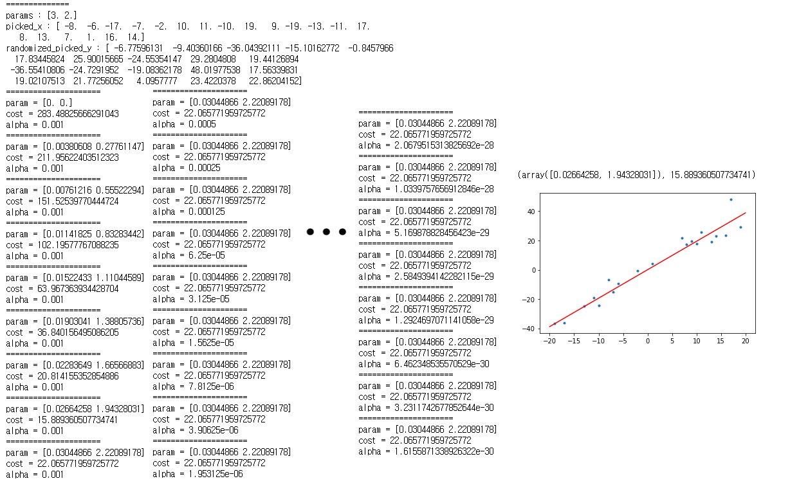

# 경사하강법을 사용한 선형회귀(LinearRegression with gradient descent)
#### 경사하강법을 사용해 선형회귀를 구현
---
## 개념
* 선형회귀 : 종속변수 y 와 한 개 이상의 독립 변수 x 와의 선형 상관 관계를 모델링하는 기법
* 주어진 데이터의 값과 예상 데이터의 값을 비교한 뒤 파라미터를 업데이트

$$MSE=\frac{1}{N}\sum_{i=0}^{N-1}(y_{i}-\widehat{y_{i}})^2 = \frac{1}{N}\sum_{i=0}^{N-1}(y_{i}-(wx_{i} + b))^2$$

## 목표
* 임의의 경향성이 존재하는 데이터 집단을 생성한 뒤 이를 가장 잘 설명할 수 있는 방정식을 찾는다
* 방정식은 선형 방정식으로 설정한다

## 코드
```python
# --------------------------- modules --------------------------- #
import random as rd
import numpy as np
import matplotlib.pyplot as plt

# -------------------------- functions -------------------------- #

# 함수의 계수를 랜덤으로 추출
def random_func(var_num, var_range):
    # [1, 6) 범위 -> 2차 함수를 사용할 예정이고 convex 함수여야 경사하강법을 사용할 수 있음
    var_picked = np.random.randint(1, var_range+1, size=var_num)
    print(var_picked)
    return var_picked

# 함숫값 계산
def cal_func(var_list, x_index):
    x_list = np.array([x_index**i for i in range(len(var_list))])
    return sum(var_list*x_list)

# 미분
def grad_func(var_list, x_index):
    # 일반적으로 람다값이 1e-6 일때 퍼포먼스가 좋다고 함
    lambda_x = 1e-6
    func_val = cal_func(var_list, x_index)
    func_val_lambda = cal_func(var_list, x_index+lambda_x)
    return (func_val_lambda - func_val) / lambda_x

# 경사하강법
# 테스트를 위해 랜덤한 파라미터를 샘플링
def make_random_params(param_range):
    # 1차 함수 샘플링
    return np.random.randint(1, param_range+1, size=2).astype('float')

# 함수값 계산
def cal_func(params, x_index):
    x_values = [x_index**i for i in range(len(params))]
    return params.dot(x_values)

# 함수값을 기반으로 랜덤한 데이터를 만들기
def make_random_points(params, points_num):
    picked_x = np.random.choice(np.arange(-20, 21), points_num, replace=False).astype('float')
    picked_y = cal_func(params, picked_x).astype('float')
    randomized_picked_y = picked_y*(np.random.rand(points_num)+0.5)
    print('==============')
    print(f'params : {params}')
    print(f'picked_x : {picked_x}')
    print(f'randomized_picked_y : {randomized_picked_y}')
    return picked_x, randomized_picked_y

# 손실함수, 코스트 계산
def loss_func(temp_param, picked_x, picked_y):
    temp_cal = cal_func(temp_param, picked_x)
    return sum(((picked_y - temp_cal)**2)/(len(picked_x)*2))

# 미분
def grad_func(target_func, target_param, param_val, picked_x, picked_y):
    lambda_grad = 1e-6
    changed_val = param_val.copy()
    changed_val[target_param] += lambda_grad

    return (target_func(changed_val, picked_x, picked_y) - target_func(param_val, picked_x, picked_y))/lambda_grad

# 경사하강법 시행
# 원래 시행 횟수만으로 실행종료가 되게 하려고 했지만 정밀도를 높이고자 파라미터 갱신이 안될 경우
# 학습률을 조절하여 학습률이 일정 수치 이하로 떨어질 때 또한 실행종료
def gradient_decent(param_range, points_num, init_params, alpha, limit_alpha, epochs):
    params = make_random_params(5)
    picked_x, randomized_picked_y = make_random_points(params, points_num)
    min_cost = np.inf
    min_param = []
    cnt = 0
    while True:
        if cnt > epochs or alpha < limit_alpha:
            plt.plot(picked_x, randomized_picked_y, '.')
            plt.plot([-20, 20], cal_func(min_param, np.array([-20, 20])), 'r')
            return min_param, min_cost
        
        cost = loss_func(init_params, picked_x, randomized_picked_y)
        
        print('=====================')
        print(f'param = {init_params}')
        print(f'cost = {cost}')
        print(f'alpha = {alpha}')
        grad = np.array([])
        for i in range(len(init_params)):
             grad = np.append(grad, grad_func(loss_func, i, np.zeros(2, 'float'), \
               picked_x, randomized_picked_y))
                
        if cost < min_cost:
            min_cost = cost
            min_param = np.copy(init_params)
            init_params -= alpha*grad
        
        else:
            alpha /= 2
        
        
        cnt += 1

# -------------------------- progress -------------------------- #
gradient_decent(5, 20, np.zeros(2, 'float'), 1e-3, 1e-30, 200)
# ---------------------------- plot ---------------------------- #
함수 내부에서 실행됨
```
