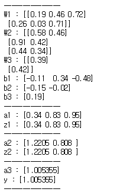

# Neural_network

#### 인간의 두뇌에서 영감을 얻은 방식
#### 데이터를 처리하도록 컴퓨터를 가르치는 인공 지능 방식
---
## 개념
* 입력층 : 외부에서 인공 신경망으로 정보가 입력되는 계층
* 은닉층 : 입력층이나 다른 은닉층에서 입력을 받아 분석해 추가 처리 뒤 다음 계층으로 전달하는 계층
* 출력층 : 모든 데이터의 최종 결과를 제공하는 층

## 목표
* 인공 신경망의 기본 구조를 구현

## 코드
```python
# --------------------------- modules --------------------------- #

import numpy as np

# -------------------------- functions -------------------------- #

# 신경망 생성
def init_network():
    network = {}
    network['W1'] = np.around(np.random.rand(2, 3), 2)
    network['b1'] = np.around(np.random.rand(3)-0.5, 2)
    network['W2'] = np.around(np.random.rand(3, 2), 2)
    network['b2'] = np.around(np.random.rand(2)-0.5, 2)
    network['W3'] = np.around(np.random.rand(2, 1), 2)
    network['b3'] = np.around(np.random.rand(1)-0.5, 2)
    
    return network

# 활성화 함수
def relu(x):
    bool_x = x > 0
    return bool_x * x

# 순전파
def forward(network, x):
    W1, W2, W3 = network['W1'], network['W2'], network['W3']
    b1, b2, b3 = network['b1'], network['b2'], network['b3']
    
    print(f'{"-"*15}')
    print(f'W1 : {W1}')
    print(f'W2 : {W2}')
    print(f'W3 : {W3}')
    print(f'b1 : {b1}')
    print(f'b2 : {b2}')
    print(f'b3 : {b3}')
    print(f'{"-"*15}')
    
    a1 = np.dot(x, W1) + b1
    z1 = relu(a1)
    
    print(f'a1 : {a1}')
    print(f'z1 : {z1}')
    print(f'{"-"*15}')
    
    a2 = np.dot(z1, W2) + b2
    z2 = relu(a2)
    
    print(f'a2 : {a2}')
    print(f'z2 : {z2}')
    print(f'{"-"*15}')
    
    a3 = np.dot(z2, W3) + b3
    y = relu(a3)
    
    print(f'a3 : {a3}')
    print(f'y : {y}')
    print(f'{"-"*15}')
    
    return y

# -------------------------- progress -------------------------- #

network = init_network()
x = np.array([1, 1])
y = forward(network, x)

# ---------------------------- plot ---------------------------- #
```

